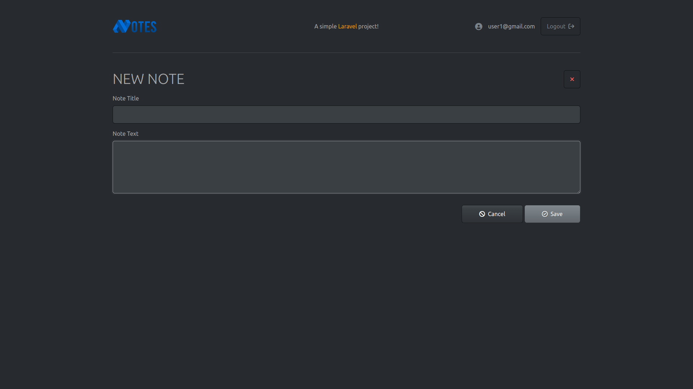

# Laravel Notes
Meu primeiro projeto desenvolvido com PHP e Laravel. Nesse projeto foi desenvolvido um sistema de anotação, onde o usuário pode criar, editar e deletar notas criadas por ele.

## Objetivo Principal
Explorar os pilares fundamentais do Laravel e aprender como utilizá-los em um projeto prático.

## O que Aprendemos
- Como criar um projeto Laravel
- Introdução às Routes
- Introdução aos Controllers
- Introdução às Views e ao Blade
- Blade Layouts
- Validação de formulários
- Conexão com MySQL
- Migrations
- Seeders
- Introdução ao Eloquent ORM Model
- Operações CRUD com Models
- Encriptação de dados
- Soft Delete e Hard Delete

## Screenshots do Projeto

| Login Screen          | Home Screen          |
|-----------------------|----------------------|
|  |  |

| New Note Screen       | Home Screen With Notes |
|-----------------------|-------------------------|
|  |  |

---